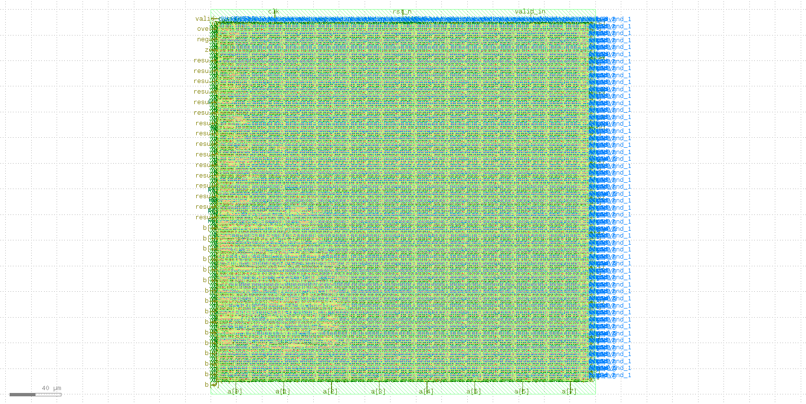

# 16-bit Pipelined ALU: RTL-to-GDSII Flow

This repository documents the process of taking a simple 16-bit pipelined ALU, written in Verilog, through a full RTL-to-GDSII (ASIC) flow.

The primary goal of this project was to test and learn the end-to-end toolchain using [OpenLane2](https://github.com/efabless/openlane2) and the [SkyWater 130nm](https://github.com/google/skywater-pdk) open-source PDK.

## Final GDSII Layout

Here is a screenshot of the final GDSII layout, viewed in KLayout.




## Project Specifications

* **Design:** 16-bit Pipelined Arithmetic Logic Unit (ALU)
* **Pipelining:** `3-stage`
* **ALU Operations:**
    * `ADD`
    * `SUB`
    * `OR`
    * `XOR`
    * `SLL`
    * `SRL`
    * `SLT`
* **Technology:** SkyWater 130nm (`sky130_fd_sc_hd`)

## Toolchain & Flow

* **ASIC Flow:** OpenLane2
* **PDK:** SkyWater 130nm (SKY130A)
* **Standard Cell Library:** `sky130_fd_sc_hd`
* **Synthesis:** Yosys
* **Place & Route:** OpenROAD

## How to Replicate the Run

1.  **Clone the repository:**
    ```bash
    git clone https://github.com/pickle-lotus0976/alu-pipeline.git
    cd alu-pipeline
    ```
2.  **Install dependencies:**
    * Ensure you have a working OpenLane2 environment.
    * Ensure the SkyWater 130nm PDK is installed.
3.  **Run the flow:**
    ```bash
    openlane config.json
    ```

## Key Run Results & Metrics

The following metrics were extracted from the final run logs (`RUN_2025-11-03_20-52-37`).

### 1. Floorplan & Die Area
| Metric | Value |
| :--- | :--- |
| Die Area | $300.0 \mu m \times 300.0 \mu m$ |
| Core Area | $288.88 \mu m \times 277.44 \mu m$ |

### 2. Cell Count (Post-Global Routing)
This is the final cell count after all synthesis, CTS, and optimization stages.

| Cell Type | Count |
| :--- | :--- | 
| **Total Cell Instances** | **2078** |
| Sequential Cells | 55 |
| Combinational Cells | 488 |
| Timing Repair Buffers | 150 |
| Clock Buffers | 6 |
| Tap Cells | 1144 |
| Fill Cells | 204 |
| Antenna Cells | 4 |

### 3. Clock Tree Synthesis (CTS)
| Metric | Value | 
| :--- | :--- |
| Clock Sinks (Flip-flops) | 55 |
| Clock Tree Structure | H-Tree |
| Buffers Inserted (CTS) | 5 |

### 4. Routing (Post-Global Routing)
| Metric | Value |
| :--- | :--- |
| **Total Wirelength** | **$38515 \mu m$** |
| **Congestion** | **0/0/0 (H/V/Total Overflow)** |
| Final Number of Vias | 5648 |

### 5. Final Static Timing Analysis (STA)
This is the final timing report after Place & Route.

| Corner | Metric | Value |
| :--- | :--- | :--- |
| **Overall** | **Setup WNS (Worst Negative Slack)** | **$-0.9460 \ ns$** |
| **Overall** | **Setup TNS (Total Negative Slack)** | **$-5.7466 \ ns$** |
| **Overall** | **Setup Violating Paths** | **40** |
| **Overall** | **Hold WNS (Worst Negative Slack)** | **$0.1448 \ ns$** |
| **Overall** | **Hold Violating Paths** | **0** |

## Next Steps

* **Timing Closure:** The primary goal for the next iteration is to fix the 40 setup violations (WNS: -0.9460 ns). This could involve:
    * Revisiting the design's pipelining and logic depth.
    * Adjusting synthesis and PnR constraints.
    * Exploring different flow strategies for optimization.
* **Design Rule Checking (DRC) & LVS:** Run a full DRC and LVS check on the final GDSII to ensure it is manufacturable.

## References & Acknowledgements

The Verilog RTL for the ALU was designed by applying concepts and examples from the following foundational texts:

* *Verilog HDL: A guide to Digital Design and Synthesis* by Samir Palnitkar
* *Fundamentals of Digital Logic with Verilog Design* by Stephen Brown and Zvonko Vranesic

## License

This project is licensed under the Apache-2.0 License. See the `LICENSE` file for details.
